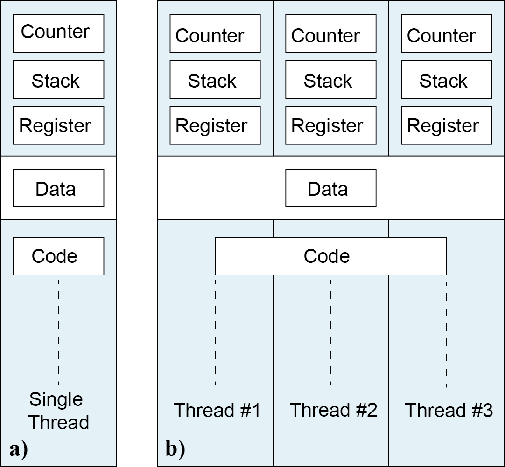
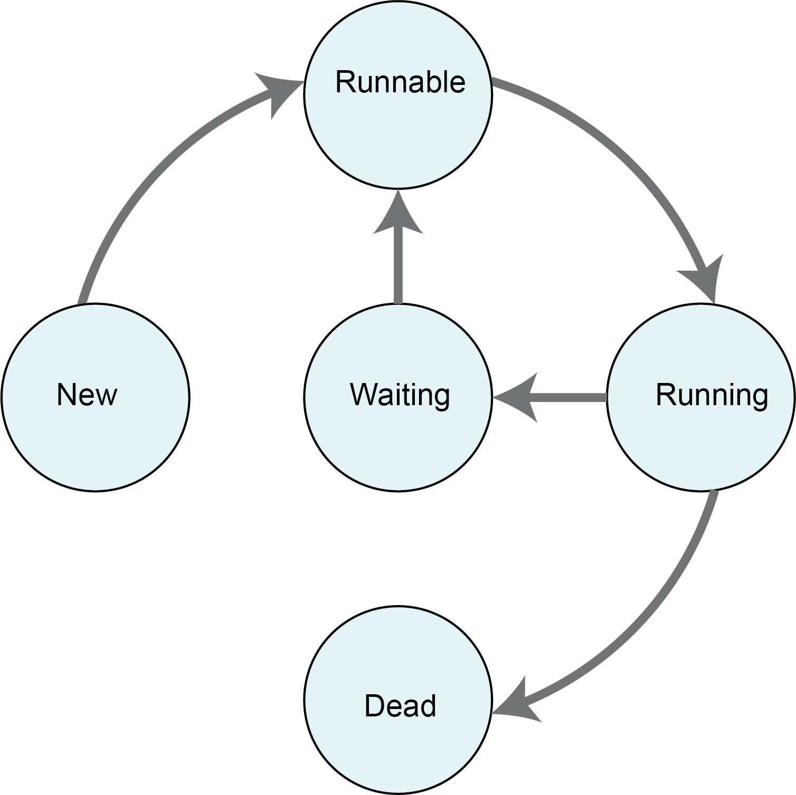
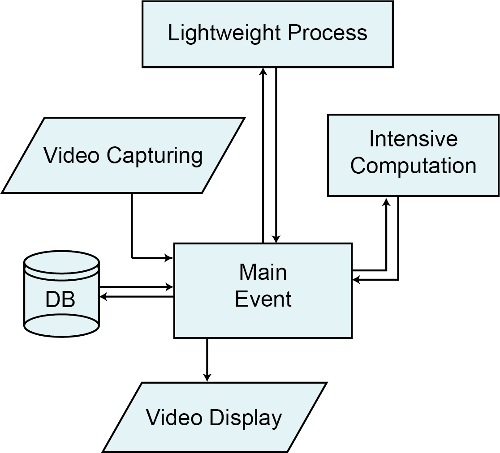

## An Overview of Concurrency
## Case Study:  Live Data Streaming

## Written by: Naeem Khoshnevis

### **I. Introduction** 
Application of machine learning, specifically deep learning algorithms in scientific research and solving business problems, has gained substantial interest during the recent years. Sensors for data acquisition are cheaper and more accurate than before. Small research groups or businesses have the possibility of storing a large amount of data, and high-performance computing resources are more accessible than before. As a result, intensive data-driven studies have become a significant part of many research fields and businesses. These studies require handling significantly large datasets, and also, they demand intensive computation. Such studies with different steps in input data, preprocessing, analysis, prediction model training, post-processing, output data, as well as updating models, are good candidates for implementing and studying the concept of concurrency.
A typical data-driven system or practical prediction model can have three main parts: 

- The system requires some data; as a result, there should be one source of incoming data
- It requires to process the incoming data and produce some results or decisions
- The system requires to implement or present the results.

A brief review of the published codes and papers indicates that concurrency is mostly ignored in these studies. One reason is the fact that it is considered an advanced programming feature. As a result, researchers are primarily dependent on the features which are provided with deep learning packages (e.g., see Keras as a high-level neural network API, written in Python and capable of running on top of TensorFlow, CNTK, or Theano [1])

Because modern computers are equipped with multiple CPU cores, as a result, harnessing available computational resources can improve the performance of the data-driven systems and speed up the intensive computational processes. In this study, I present a practical overview of concurrency. First, I present an overview of concurrency in general, then I continue with more technical details on the implementation of concurrency in Python. I develop a live data streaming system with different computational features, and I apply concurrency at different levels. I use the Python programming language as a study platform and different processing packages.
The study shows that concurrency significantly improves the performance of the system, and in many cases, keeps the system responsive for incoming data. It should be considered as one of the crucial steps of developing any data-driven system and product to harness the computational resources in the system effectively.

### **II. Concurrency**

Concurrency is defined as the ability to conduct several computations at the same time or the ability to run different parts of code out of order in an overlapping period instead of executing in sequential order. In practice, concurrency is managing the available shared resources (CPU and Memory) among different programs [2]. In many cases, concurrency is confused with parallelism. Parallelism is utilizing different CPU cores and using mostly the same code on different data. Parallelism is the ability to split the tasks into subtasks that can be processed at the same time.

Concurrency can be implemented in different levels. Reference [3] defiened concurrency in three levels:
- Low-Level Concurrency: This level of concurrency makes explicit use of atomic operations. Atomic op- erations are program operations that run completely independently of any other processes. This level of concurrency is for library writers.
- Mid-Level Concurrency: This is concurrency that does not use any explicit atomic operations but uses explicit locks. Most programming languages support this kind of concurrency.
- High-level Concurrency: In this level of concurrency there is no explicit atomic operations and no explicit lock.

In this study, I am interested in implementing concurrency in developing applications; as a result, low-level concurrency is beyond the scope of this project. Implementing mid-level concurrency is practical in many applications; however, it is very error-prone. Problems that are hard to track down and occurring without any discernible pattern can happen in this level of concurrency. High-level concurrency reduces the possibility of these errors; it is easy to implement; however, it provides limited choices in implementation and level of user control [3].

Regardless of the level of concurrency, a concurrent program or system should be correct. The application should start from the initial state and correctly stop at the final state. In other words, it should provide the same correct answer as a sequential program.

To better understand concurrency in practice, we need to be familiar with processes and threads. A program under execution is called a process and is created by the operating system. Each process has its own dedicated memory and is not allowed to have access to other processes’ memory. Independent lightweight processes within a process are called threads. A thread, which is also known as a basic unit of CPU utilization, executes its own piece of code independently from other threads [2].

Multithreading (or threading for simplicity) is the ability of the central processing unit (CPU) to provide multiple threads of execution. This operation should be implemented in a way to make sure that the result of the multithreaded program is the same as the case when it is run sequentially. It is recommended that the nonconcurrent program be written first, if possible. If it is correct, then look for possible locations that can be run concurrently without loss of performance and correctness [3].

Sharing data is the most critical challenge in concurrent programming. The programmer, or concurrency modules, should make sure that the shared data is accessible and modifiable only through one thread at a time. Different approaches to sharing resources are the main difference between threading and multiprocessing. Execution through threading allows multiple threads exist and execute independently but share their process resources within the context of a process. Each process is isolated from other processes on the same machine. Different threads within one process have access to shared memory. However, communication between processes is implemented mostly by Inter-Process Communications (IPC). Fig. 1 shows an example of processes with single and multi-thread. In each process, threads share data and code; however, each thread has its dedicated stack, counter, and register (for more details about threads components see [2])

<figure class="image">
  
  <figcaption>Fig 1. Schematic representation of two processes. a) A process with a single thread. b) A process with three threads. The components of each thread are represented. In each process, threads share data and code.</figcaption>
</figure>

              
 <br/>Sharing I/O resources is another important topic in developing concurrent systems. If one thread takes an I/O resource and does not release it, other threads should wait for releasing that resource. This situation can undermine the benefits of concurrency. It may happen at internal states of a thread’s lifecycle, which can go into an infinite loop. A thread, in general, has five states in its lifecycle, including:

- New: a thread is created but not scheduled to run.
- Runnable: the thread is scheduled to run.
- Running: the thread is executing code.
- Waiting: the thread is paused. Either waiting for a response from other threads or I/O resources.
- Dead: the thread completed its tasks and is terminated.

Fig. 2 shows the general lifecycle of a thread. According to this figure, a new thread is created and is being scheduled to run. At the next step, it runs the code; however, depending on the thread’s status, it can either go to the Waiting state or the Dead state. A thread in the Waiting state is called a paused thread, and generally, a thread is paused because it is either waiting for the response of some I/O request or waiting for the completion of the execution of other threads. The thread terminates execution at the Dead state [4].

<figure class="image">
  
  <figcaption>Fig 2. A thread lifecycle. The thread starts at the New state and terminates at the Dead state.</figcaption>
</figure>

              
 <br/>In this section, so far, I have discussed different aspects of threads. Threading can enhance the speed of computation by using the full potential of the hardware of the system, specifically with multiprocessor CPUs. In applications with a graphical user interface (GUI), threading will help the program to remain responsive. I will discuss such an ap- plication in the Case Study section. With all these and many other advantages of threading, it has excessive complexity in the system design, implement, test, and debug steps. The other disadvantage is data security. A comprehensive plan is required to make sure that data is secured, and no more than one thread has access to data at one time.

In comparing threading and multiprocessing, processes have more overhead than threads as opening, and closing processes take time. On the other hand, sharing data between processes is slower than threads because threads share memory space. Threads can efficiently read and write from the same memory space. There is an overhead associated with launching and maintaining multiple tasks. Studying this is beyond the scope of this study. However, in general, I/O bound operations are good candidates for multithreading, and CPU bound operations are good candidates for multiprocessing.

In all major programming languages, threading and multiprocessing are implemented, and a sufficient amount of modules, packages, and classes are provided to the users to implement concurrency, mostly at mid and high-levels. In the next section, I will study the threading and multiprocessing in Python programming language, which helps to continue the concurrency discussion at a practical level.

### **III. Threading and MultiProcessing in Python**

Python is one of the most popular programming languages in developing intelligent systems, prediction models, and data-driven products. In this section, I review different aspects of concurrency in Python.

**A.** Global Interpreter Lock 

Python executes programs by interpreting program instructions or bytecodes. Python is not a thread-safe programming language; as a result, only one thread at a time can execute the program’s instruction. The Global Interpreter Lock (GIL) is defined to prevent more than one thread at a time to execute the code. The GIL is a mutex that allows only one thread to hold control of the Python interpreter [5]. There are numerous discussions about the GIL; each year, many researchers and developers suggest improvements on the GIL. These proposals are called Python Enhancement Proposals (e.g., see [6] and [7]). The GIL is a single lock that prevents multiple threads from executing Python code concurrently. Although the GIL makes sure that all instructions are executed in a thread-safe environment, it seems an unpleasant feature that can significantly reduce the Python code performance during an execution.      
To some extent, the statement is accurate, and Python is not a capable multithreading programming language. However, that is not the case in many applications. Python programs are mostly wrappers around many low-level packages. The GIL is only concerned with Python bytecode execution. As a result, any thread-safe extension that uses many CPU cores will release the GIL as long as it does not need to interact with Python runtime. This is also the case with I/O operations. Discussing the mechanism of the GIL in detail is beyond the scope of this study. In summary, we can say the GIL is a mechanism to make Python a thread-safe programming language; however, it comes with restrictions.        
Each thread that possesses the GIL is required to release it after a predetermined time. After Python 3.2, this time has been set to 5 milliseconds(ms), which relatively improved the responsiveness of the threads. During the runtime, after each 5 ms, the thread who has the GIL releases it. Other threads, including the thread who released the GIL, compete to acquire the GIL. A thread (based on priorities) acquires the GIL and run the program. If any I/O operation happens before 5 ms, the GIL will be released. The threads which do not have the GIL will run I/O operations (probably waiting for data from network), or conducting CPU bound computations (e.g., using numpy for matrix multiplication). If the results need to get back to the program, upon getting the results, these threads will compete again to acquire the GIL. Based on the applications of machine learning, intelligent systems, and data-driven products, the GIL is not a problem toward getting the full potential from hardware [3]. It is worth to mention that the GIL only a topic for CPython, which is the reference implementation of the Python programming language written in C and Python [8]. Other versions of Python implementation (e.g., Jython and IronPython, which are implemented in the Java platform and .net framework) does not use the GIL for thread safe mechanism. They perform intelligent thread scheduling, which can be a topic for another study.

**B.** Implementing Threading

There are three major modules in Python to implement concurrency, including:

- Threading
- Multiprocessing
- Concurrency

In Threading, every thread is considered as an object of the Threading class. It provides high-level support for threads. There are several methods to control the thread lifecycle. The most common methods include:

- run()
- start()
- join()

The run() method includes the functions to run with threading. The start() starts the thread by calling the run method, and the join() waits for the thread to terminate. In the following,  I present an example of starting and running a thread using the threading module. In this example, I started thread 1; however, I call the join() method before starting other threads. It means we need to wait to get the result of that thread and terminate it then move to other threads. Since for thread number 2-4, I did not call the join() method, after starting the thread number 2, the GIL is released, and thread number 3 created, and again the GIL is released, and thread number 4 is created. After one second of sleep, each thread competes to acquire the GIL and run the rest of its function, which is ”Thread x finishing.” The racing of each thread to acquire the GIL can be tested in several repetitions of the example. One can see that the finishing message can be out of order.

```python
from threading import Thread as th
import time

def run(name):
    print(f"Thread {name} starting ...")
    time.sleep(1)
    print(f"Thread {name} finishing.")

t1 = th(target=run, args=(1,))
t2 = th(target=run, args=(2,))
t3 = th(target=run, args=(3,))
t4 = th(target=run, args=(4,))
t1.start()
t1.join()
t2.start()
t3.start()
t4.start()

Output:

Thread 1 starting ...
Thread 1 finishing.
Thread 2 starting ...
Thread 3 starting ...
Thread 4 starting ...
Thread 2 finishing.
Thread 3 finishing.
Thread 4 finishing.
```

Multiprocessing, on the other hand, is a module to use two or more CPU units within a single or multiple computer systems. It is the best approach to get the full potential from the system’s hardware by utilizing the full number of CPU cores available in the system. Multiprocessing makes parallel computing possible. An example of multiprocessing is similar to threading; however, instead of Thread, one needs to use the Process class. Similar to threading, multiprocessing has start() and join() methods, among other methods, to control the processes.

The last module is Concurrency, which is one of the recent modules added to Python (added after Python 3.2) to provide a high-level concurrency. The idea is creating a pool of idle threads or processors and assign computational work to them. If the application requires a higher number of threads, assigning tasks manually can be error-prone and computationally expensive and can cause performance issues. To overcome this issue, and to reuse available threads, a thread and processors pools are defined. One can consider a thread pool as a group of idle threads that are ready to be assigned a new task. By reusing available threads, the thread pool considerably reduces the overhead by creating new threads.

This is very important if we develop an application with a large number of tasks. The thread pool has a fixed number of threads, which is set by the programmer. If a thread in a thread pool completes its execution, then the thread can be reused. However, for any reason, if the thread is terminated and leave from the pool, a new thread will be generated and will be replaced by that thread. See [9] for more details.
I discussed an overview of threading in Python and presented a simple example of creating and terminating a thread. However, concurrency is a very comprehensive concept. It has many details in software design, synchronization, intercommunication, testing, and debugging, among many other topics. Interested readers can see [3] for more details. To narrow the discussion, in the next section, I discuss the event-driven programming, which is directly related to this project’s case study.

**C.** Event Driven Programming

Event-driven programming is an area of programming that concurrency plays a vital role. In this type of programming, the flow of the program depends upon events. The program’s event loop always listening for upcoming events and act accordingly. A good example of event-driven programming is applications with graphical user interfaces. Depending on the application, the user can request different tasks. These tasks can be I/O operations or intensive CPU computations. The main thread keeps the event loop responsive and delegates other tasks to new threads or, at some point, new processes. Fig. 3 shows a diagram for event-driven programming. As long as the system is not shut down or crashed, the request/response loop is running.

<figure class="image">
  
  <figcaption>Fig 3. A flowchart of event-driven application</figcaption>
</figure>

 <br/> In this study, I develop an event-driven application to represent the effect of concurrency at I/O and CPU bounded tasks. In the next section, I will discuss the application in detail.

### **IV. Case Study: Live Data Streaming**

So far, an overview of concurrency is discussed, and different levels of concurrency based on threading and processing are presented. In this section, I present the concurrency in practice. A typical Intelligent System or a prediction model can have three main parts. First, it requires some data; as a result, there should be at least one source of incoming data; second, the system requires to process the incoming data and produce some results or decisions, third, the system should present the results. I develope an application for live data streaming. The application includes the following tasks:

- Capturing video
- Processing frames
- Storing frames
- Intensive computations (e.g., training a prediction model based on) new data
- Presenting the recorded video
- lightweight processes (e.g., annotating the video with the desired target values)

Fig. 4 shows the case study application flowchart. This is a typical machine learning or data product system. There is ongoing data streaming, which in this study is video capturing. The application conduct lightweight processes on the incoming data (e.g., set frame rate, create a frame, resize, change color, and so on). There is an option implemented to store the captured frame on the database. Also, the captured video is displayed, which can be annotated based on the input and the prediction model. The application also requires resources to conduct intensive computations, which can be training the prediction models. This system is a typical candidate for concurrency.

<figure class="image">
  
  <figcaption>Fig 4. A flowchart for the data-driven application of this study. The Main Event window is presented in Fig. 5. </figcaption>
</figure>

 <br/>


### References
1) F. Chollet et al., "Keras," https://keras.io, 2015
2) A. S. Tanenbaum and M. Van Steen, Distributed systems: principles and paradigms. Prentice-Hall, 2007. 
3) M. Summerfield, Python in practice: create better programs using concurrency, libraries, and patterns. Addison-Wesley, 2013.
4) https://www.tutorialspoint.com/concurrency_in_python/concurrency_in_python_threads.htm
5) "Thread state and the global iterpreter lock," "https://docs.python.org/3/c-api/init.html", 2019
6) M. Hammond, “Pep 311: Simplified global interpreter lock acquisition for extensions,” ”https://www.python.org/dev/peps/pep-0311/”, 2003.
7) E. Snow, “Pep 554: Multiple interpreters in the stdlib,” ”https://www.python.org/dev/peps/pep-0554/”, 2017. 
8) https://github.com/python/cpython
9) “The python standard library: Concurrent execution,” ”https://docs.python.org/3/library/concurrent.futures.html”, 2019.